# Лабораторная работа №1

## задание №1

## задание №2

## задание №3

## задание №4

## задание №5

#### -

# Лабораторная работа №2

## задание №1

## задание №2

## задание №3

#### -

# Лабораторная работа №3

## задание №1

## задание №2

### вариант оформления задания №2 через таблицу

#### -

# Лабораторная работа №4

## Задание №1

### Примеры вывода из мини теста:

### Вывод в check.csv

## Задание №2

### Здесь написан скрипт, который читает файл input и импортирует функции из lib (из ЛР3)

### Выполнив скрипт, который введен в консоль в файл report.csv я вывел следующую информацию:

#### -

# Лабораторная работа №5

## Задание A

### пример ввода csv-файла:

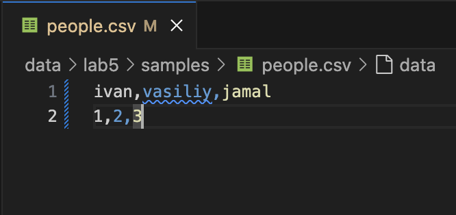

### вывод конвертации csv-файла в JSON:

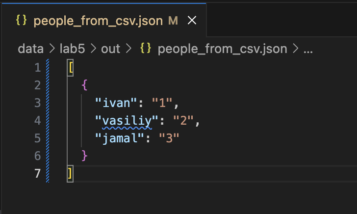

### также эти манипуляции модно провести и с JSON-файлом:

### пример вывода в csv-файл;:

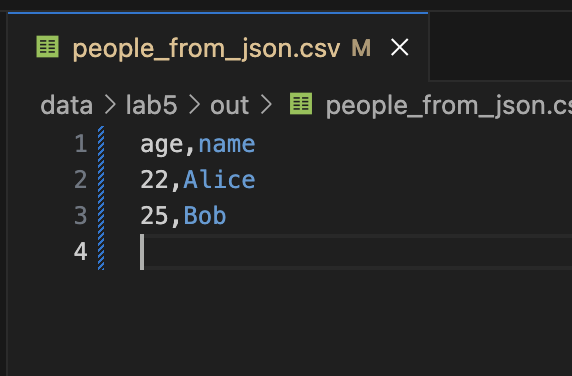

## Задание B

### вот тот же csv-файл:

### проводим конвертацию в Excel-файл:

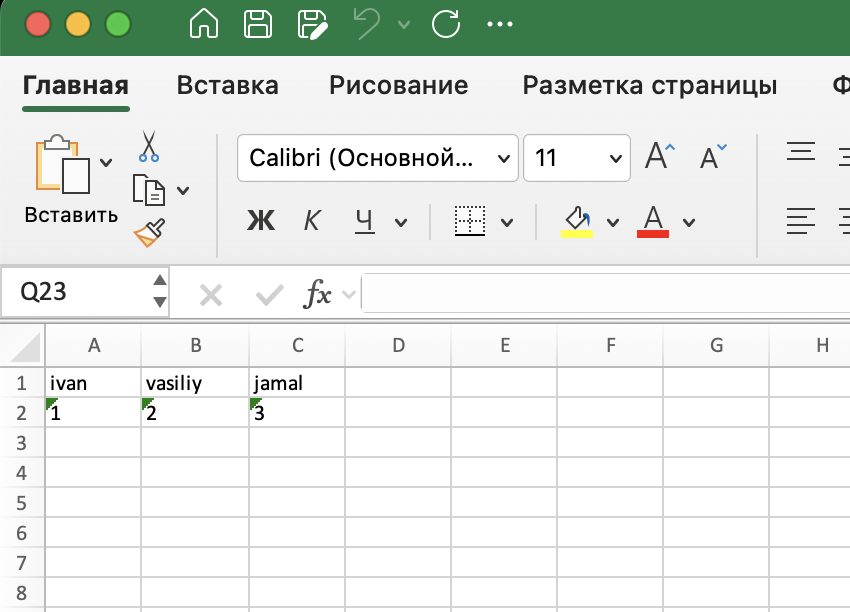

#### -

# Лабораторная работа №6

## Модуль cli_text

### Выполнение команды Cat:

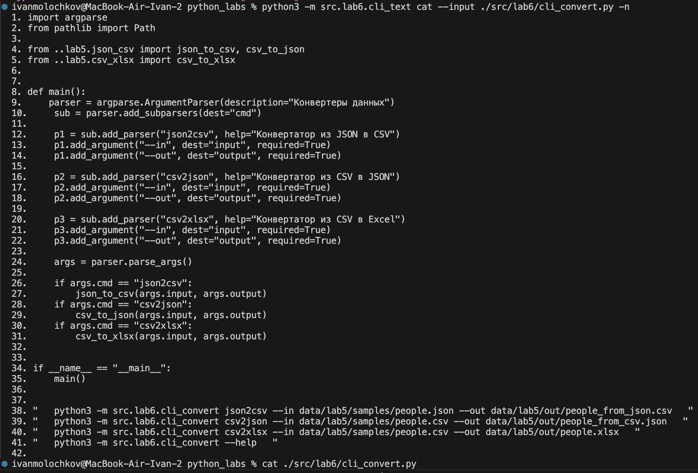

### Выполнение команды Stats:

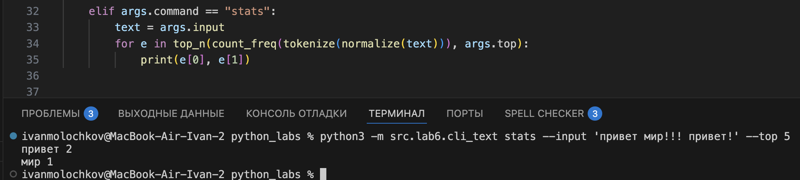

### Оформление help:

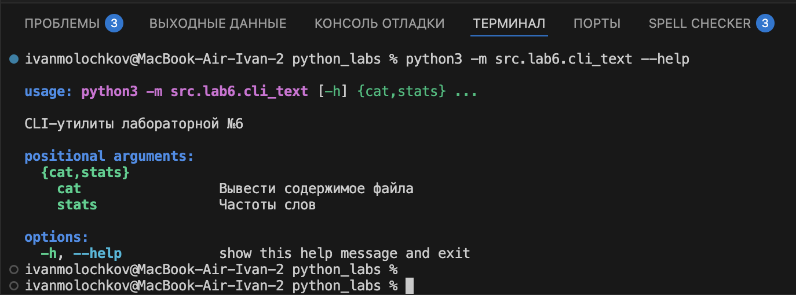

## Модуль cli_convert

### Работу функций из данного модуля можем увидеть в ЛР №5
### Поэтому приведу только оформление help:

#### -

# Лабораторная работа №7

## Тестирование кода:

### Тест кода из text_text (из ЛР №3):

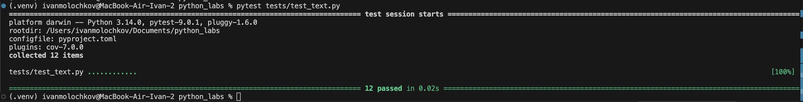

### Тест кода из text_json_csv (из ЛР №5):

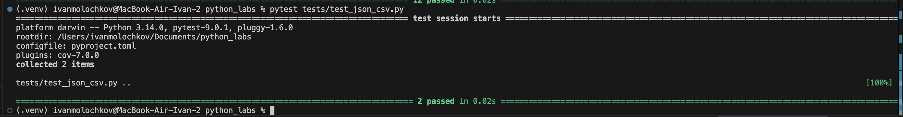

## Покрытие кода:

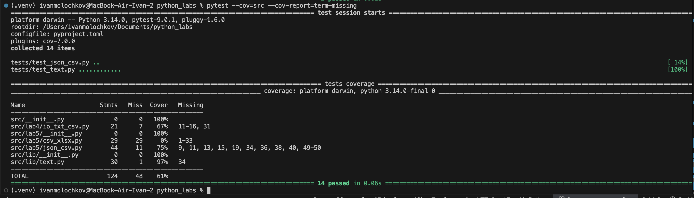

## Отчет форматирования проекта на стиль black:

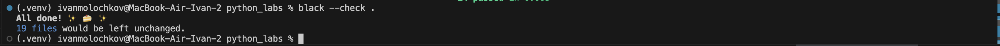

#### -

# Лабораторная работа №8

## students to json:

### Запись json-файла, используя класс Student из модуля models.py:

## students_from_json:

### Чтение json-файла:

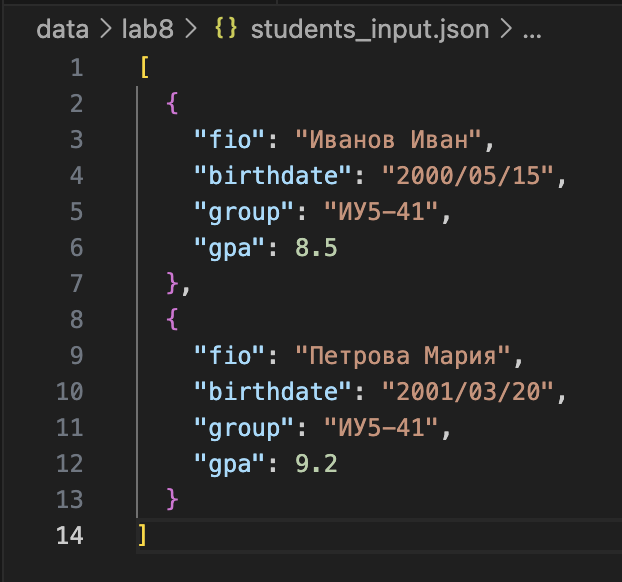

## Вывод информации в консоль:

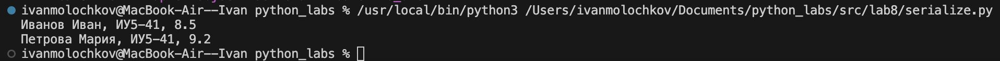

#### -

# Лабораторная работа №9

## База данных на csv-файлах:

### пустая база данных с полями:

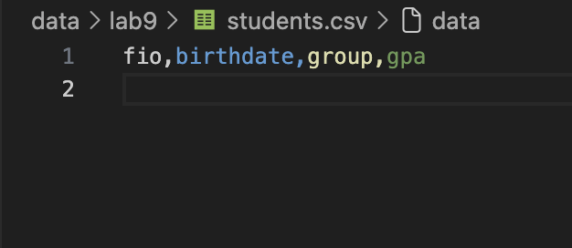

### пример выполнения кода с выводами в консоль:

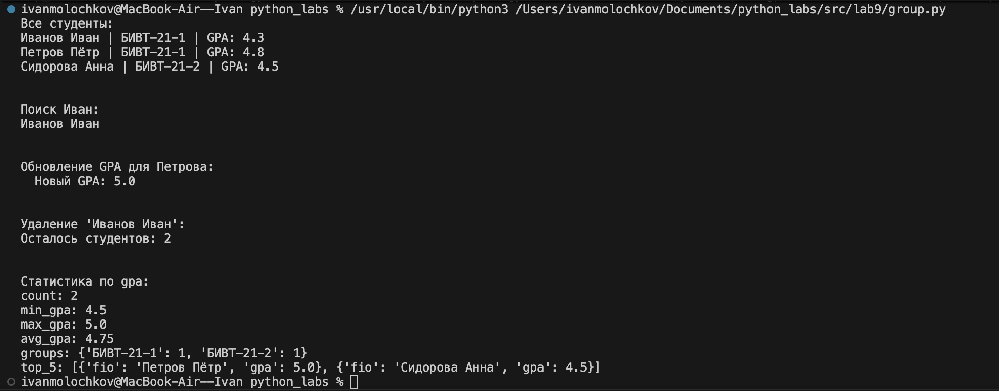

## база данных после выполнения кода:

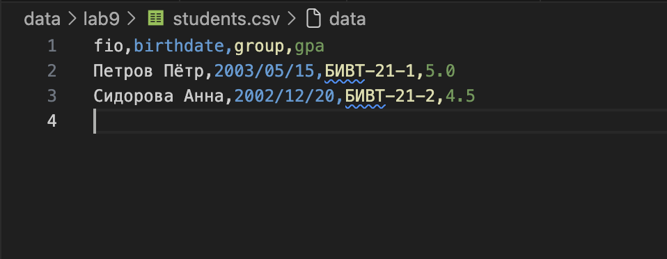

#### -

# Лабораторная работа №10

## Stack и Queue:

### Stack - принцип LIFO (Last In, First Out). Основные операции: push, pop, peek, is_empty.
### Queue - принцип FIFO (First In, First Out). Основные операции: enqueue, dequeue, peek, is_empty.

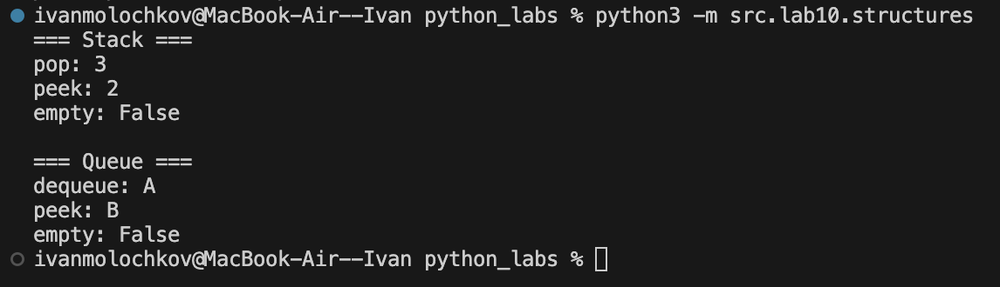

### выводы по бенчмаркам:

#### Stack (list) — push/pop O(1), быстрые операции.
#### Queue (deque) — enqueue/dequeue O(1), быстрее, чем list (pop(0) → O(n)).

## SinglyLinkedList:

### - односвязный список. Основные операции: prepend, append, insert, remove, поиск.

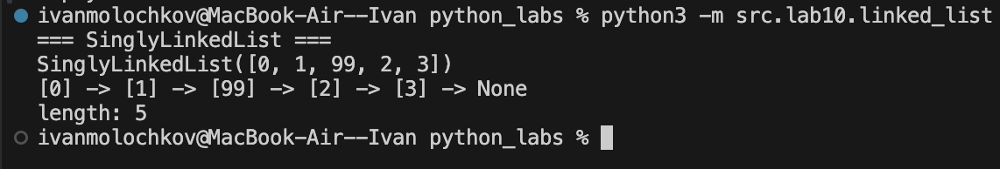

### выводы по бенчмаркам:

#### SinglyLinkedList — prepend/append O(1) при наличии tail, вставка/удаление в середине O(n), доступ по индексу O(n).