# Лабораторная работа №1

## задание №1

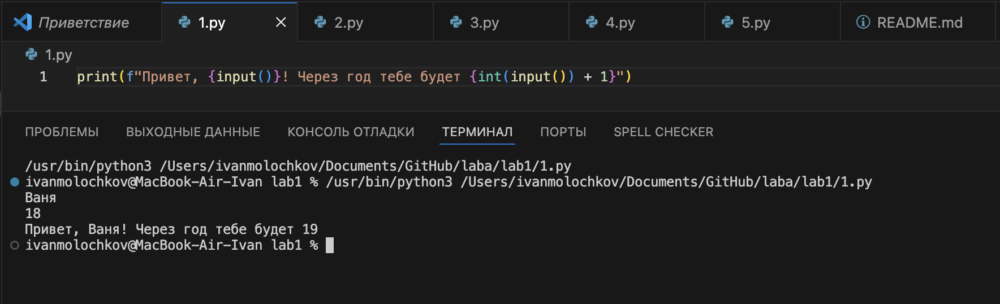

## задание №2

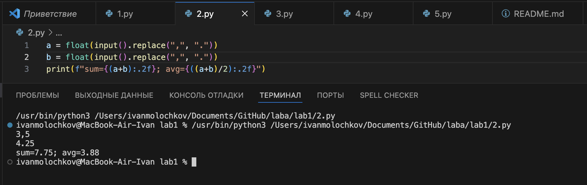

## задание №3

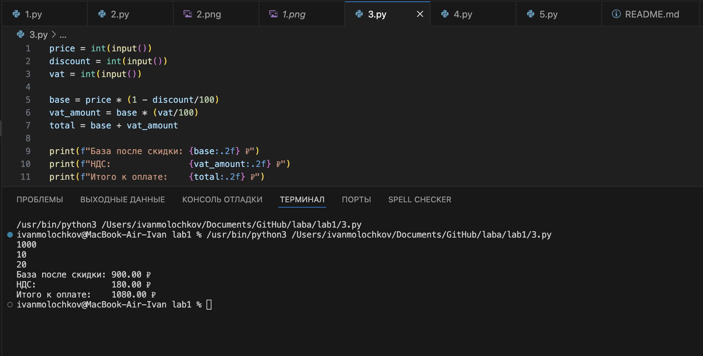

## задание №4

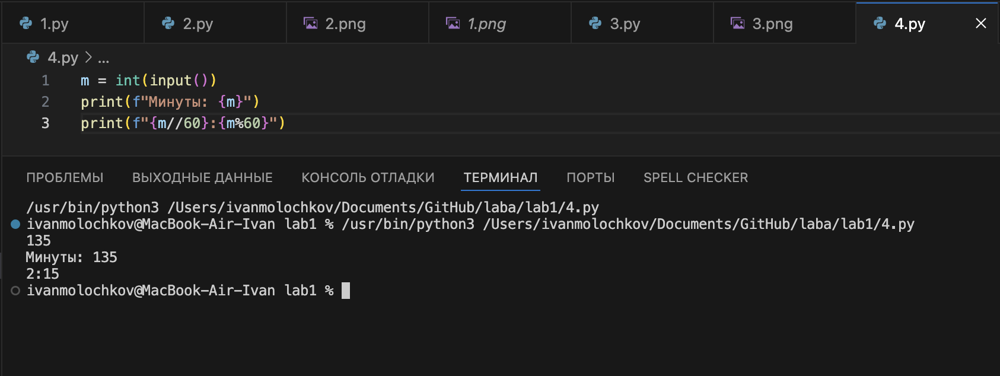

## задание №5

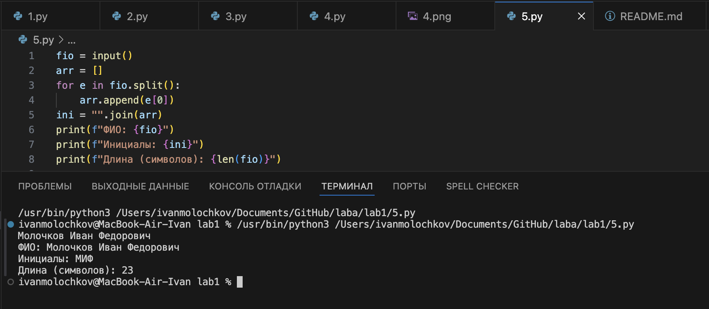

# Лабораторная работа №2

## задание №1

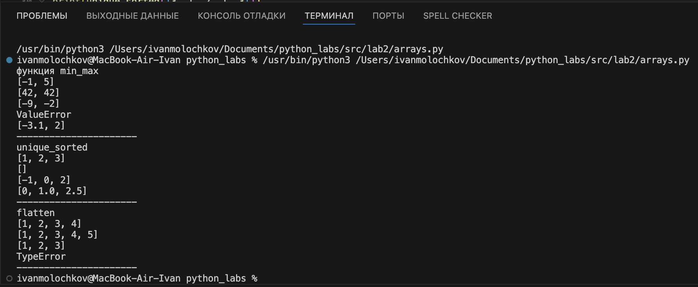

## задание №2

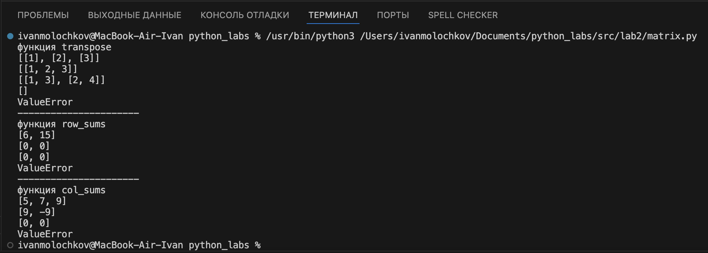

## задание №3

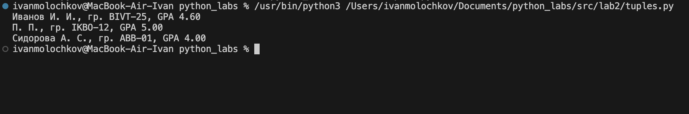

# Лабораторная работа №3

## задание №1

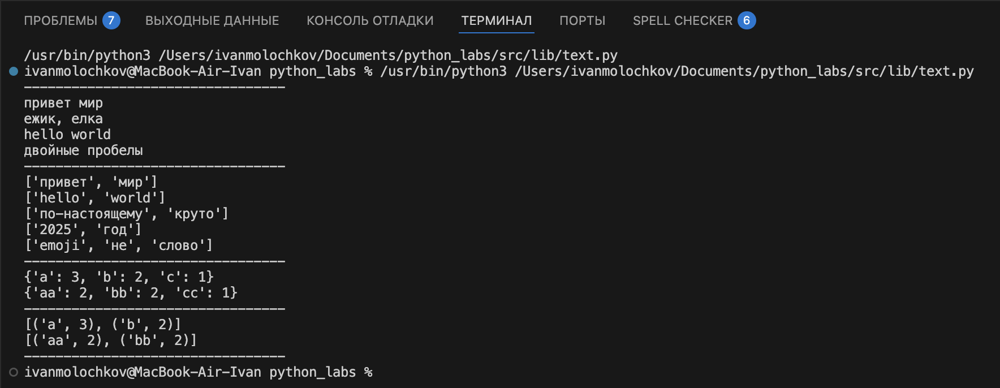

## задание №2

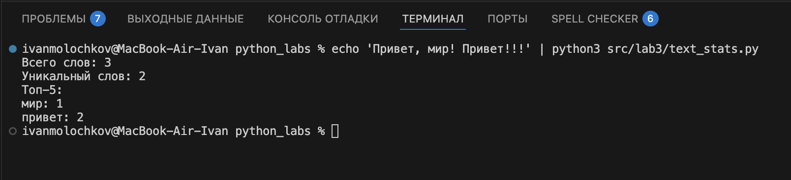

### вариант оформления задания №2 через таблицу

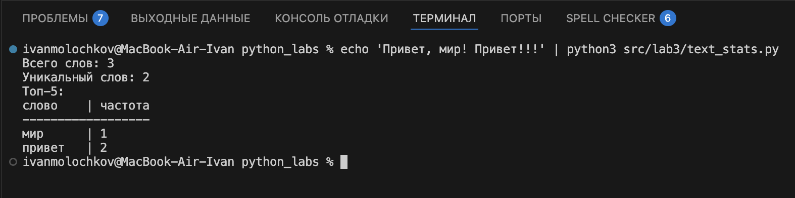

# Лабораторная работа №4

## Задание №1

### Примеры вывода из мини теста:

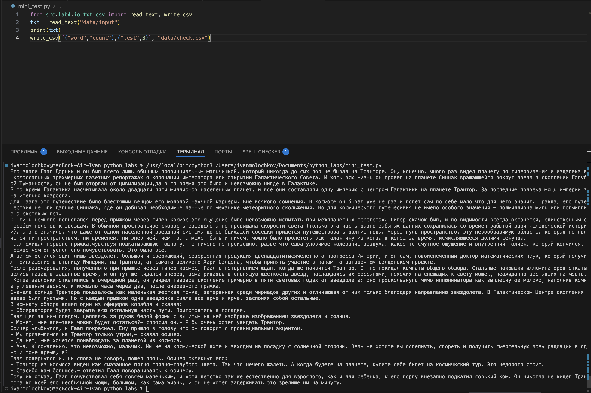

### Вывод в check.csv

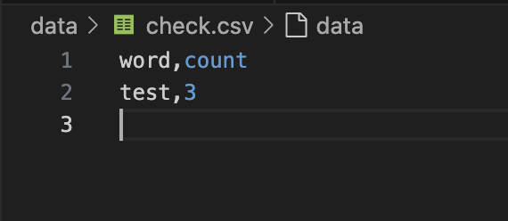

## Задание №2

### Здесь написан скрипт, который читает файл input и импортирует функции из lib (из ЛР3)

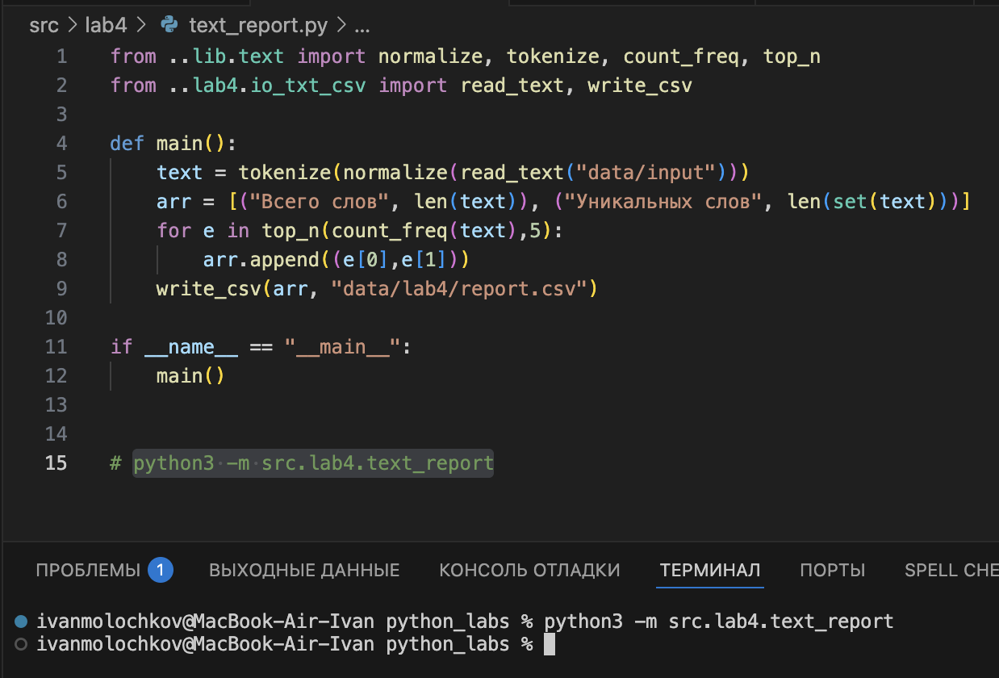

### Выполнив скрипт, который введен в консоль в файл report.csv я вывел следующую информацию:

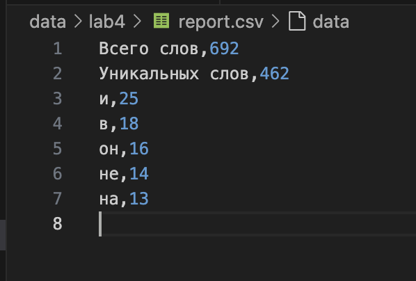
