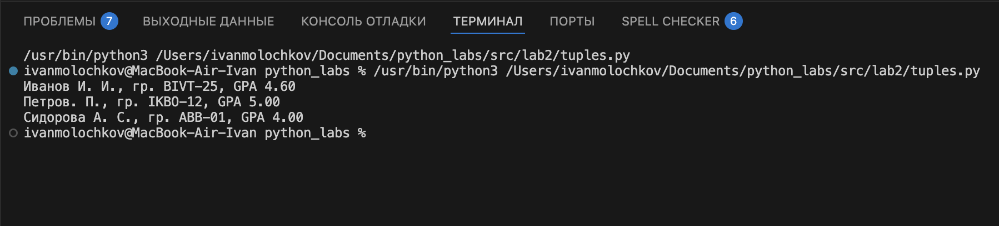

# Лабораторная работа №1

## задание №1

## задание №2

## задание №3

## задание №4

## задание №5

# Лабораторная работа №2

## задание №1

## задание №2

## задание №3

# Лабораторная работа №3

## задание №1

## задание №2

### вариант оформления задания №2 через таблицу

# Лабораторная работа №4

## Задание №1

### Примеры вывода из мини теста:

### Вывод в check.csv

## Задание №2

### Здесь написан скрипт, который читает файл input и импортирует функции из lib (из ЛР3)

### Выполнив скрипт, который введен в консоль в файл report.csv я вывел следующую информацию:

